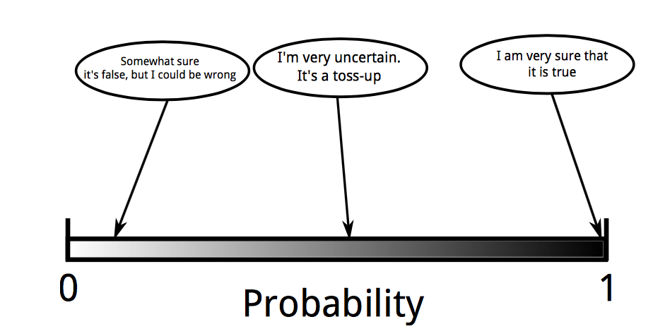

```{r setup, include=FALSE}
knitr::opts_chunk$set(echo = FALSE)
library('rstan')
options(mc.cores = parallel::detectCores())
rstan_options(auto_write = TRUE)

library('tidyr')
library('dplyr')
library('ggplot2')
library('rstanarm')
library('bayesplot')
library('cowplot')

```

## Bayesilaiset Menetelmät

- Todennäköisyys ja Bayesilainen tilastotiede
    - Bayesin kaava
    - Uskottavuusfunktio
    - Priorijakauma
    - Posteriorijakauma
- Bayesilaiset menetelmät käytännössä
- **Kalvot löytyvät osoitteesta github.com/hpesonen**

## Todennäköisyys ja Bayesilainen tilastotiede

- Bayesiläisen tilastotieteen keskiössä on maailman mallittaminen
- Bayesilainen tilastotiede mallittaa todennäköisyyden epävarmuutena todellisuudesta
- 0 ja 1 ovat skaalan kaksi ääripäätä ja vastaavat täyttä varmuutta tapahtumasta 
    - Epävarmuus on subjektiivinen käsite
    - **Maailman havannointi lisää informaatiota todellisuudesta ja vähentää epävarmuutta**
- Bayesin teoreeman käyttö ei tee kenestäkään Bayesilaista, mutta epävarmuuden ilmaiseminen todennäköisyyden avulla tekee

## Todennäköisyys ja Bayesilainen tilastotiede

- 0 ja 1 ovat skaalan kaksi ääripäätä ja vastaavat täyttä varmuutta tapahtumasta

{width=80%}


## Todennäköisyys ja Bayesilainen tilastotiede

- Informaation lisäämisen mekanismi ilmaistaan Bayesin teoreeman avulla
    - Bayesin teoreema on siis **työkalu**, jota käytetään Bayesilaisessä analyysissä

$$p(\theta \mid y) = \frac{p(y \mid \theta)p(\theta)}{p(y)}$$

## Bayesin teoreema

$$p(\theta \mid y) = \frac{p(y \mid \theta)p(\theta)}{p(y)}$$

- $\theta$: Mallin parametrit
- $y$: Data
- $p(\theta \mid y)$: Posteriorijakauma
- $p(y \mid \theta)$: Uskottavuusfunktio
- $p(\theta)$: Priorijakauma
- $p(y)$: Evidenssi/Marginaali


## Esimerkki - Kolikonheitto

- Kolikonheitto on klassinen esimerkki informaation kertymisestä havaintoaineiston kasvaessa
- Tarkastellaan kolikkoa ja halutaan selvittää onko kolikko _reilu_ 
    - Merkitään parametrilla $p$ todennäköisyyttä saada kolikonheitossa **klaava**
- Voidaan ajatella, että kolikonheitto on Bernoullin koe
    - Klaava ($y=1$) saadaan todennäköisyydellä $\theta$, jolloin kruunan todennäköisyys on $1-\theta$
    - Uskottavuusfunktio Bernoullin kokeelle on

$$p(y \mid \theta) = \theta^y(1-\theta)^{1-y}$$

## Esimerkki - Kolikonheitto

- Toistettaessa riippumattomasti kolikonheitto-koetta $N$ kertaa uskottavuusfunktio voidaan ilmaista muodossa

$$p(y_1, \ldots, y_N \mid \theta) = \prod_{i=1}^N p(y_i \mid \theta) = \theta^{\sum_{i} y_i} (1- \theta)^{N-\sum_{i}y_i} $$

## Esimerkki - Kolikonheitto

- Miten mallintaisimme epävarmuuttamme ennen ensimmäistäkään havaintopistettä?
    - Minkälainen priorijakauma vastaisi epävarmuuttamme klaavan esiintymisestä?

```{r, fig.height = 3, fig.width = 8}
p <- seq(0,1,length.out = 100)
coin_toss_prior <- bind_rows(tibble(p = p, y = dbeta(p,1,1), locx = 1, locy = 1),
                       tibble(p = p, y = dbeta(p,0.5,0.5), locx = 2, locy = 1),
                       tibble(p = p, y = dbeta(p,5,5), locx = 3, locy = 1),
                       tibble(p = p, y = dbeta(p,5,1), locx = 1, locy = 2),
                       tibble(p = p, y = dbeta(p,1,5), locx = 2, locy = 2),
                       tibble(p = p, y = dbeta(p,200,100), locx = 3, locy = 2))
ggplot(coin_toss_prior, aes(x = p, y = y)) + 
  geom_line() +
  facet_wrap(locy ~ locx) + theme_light() + 
  theme(strip.background = element_blank(),
        strip.text.x = element_blank()
)
```

## Esimerkki - kolikonheitto

- Uskoaksemme on hyvin epätodennäköistä, että melko varmasti saataisiin aina $0/1$
- Uskoaksemme kolikko on melko todennäköisesti reilu ($\theta=0.5$), mutta emme voi poissulkea mahdollisuutta, että se ei ole
- Mallinnamme prioritietämystä jakaumalla $p(\theta) \propto \theta^4(1-\theta)^4$ ($\mathsf{Beta}(5,5)$-jakauma)

```{r, fig.height = 2, fig.width = 4}
coin_toss_prior %>% filter(locx == 3, locy == 1) %>% ggplot(aes(x = p, y = y)) + 
  geom_line() +
  facet_wrap(locy ~ locx) + theme_light() + 
  theme(strip.background = element_blank(),
        strip.text.x = element_blank())

```


## Esimerkki - Kolikonheitto

- Tarkastellaan miten posteriorijakauma muuttuu heittosarjan koon kasvaessa
- Merkitään dataa $y = (n,N-n)$ :
  - Esim. $y = (10,5)$ vastaa $15$ heiton sarjaa, joista $10$ klaavaa ja $5$ kruunaa
- Tässä tapauksessa posteriori-jakauma voidaan ilmaista analyyttisesti

$$ 
\begin{aligned}
p(\theta \mid y = (n,N-n)) & \propto p(y=(n,N-n) \mid \theta) p(\theta) \\
& = \theta^{n}(1-\theta)^{N-n}\theta^4(1-\theta)^4 \\ & = \theta^{n+4}(1-\theta)^{N-n+4}
\end{aligned}
$$

## Esimerkki - Kolikonheitto

- Havaintojen määrän kasvaessa posteriori-jakauma lähestyy uskottavuusfunktiota
    - Priori-todennäköisyyden merkitys vähenee

```{r, fig.height = 3, fig.width = 8}
theta <- seq(0,1,length.out = 300)
# coint_toss_chosenprior <- coint_toss_prior %>% filter(locx == 3, locy == 1)
coin_toss <- bind_rows(tibble(theta = theta, y = dbeta(theta,5,5), locx = 1, locy = 1, type="prior", label="y=(1,0)", qlow=qbeta(0.025,5,5),  qhigh=qbeta(0.975,5,5)),
                       tibble(theta = theta, y = dbeta(theta,5,5), locx = 2, locy = 1, type="prior", label="y=(3,2)", qlow=qbeta(0.025,5,5),  qhigh=qbeta(0.975,5,5)),
                       tibble(theta = theta, y = dbeta(theta,5,5), locx = 3, locy = 1, type="prior", label="y=(10,5)", qlow=qbeta(0.025,5,5),  qhigh=qbeta(0.975,5,5)),
                       tibble(theta = theta, y = dbeta(theta,5,5), locx = 1, locy = 2, type="prior", label="y=(37,13)", qlow=qbeta(0.025,5,5),  qhigh=qbeta(0.975,5,5)),
                       tibble(theta = theta, y = dbeta(theta,5,5), locx = 2, locy = 2, type="prior", label="y=(72,28)", qlow=qbeta(0.025,5,5),  qhigh=qbeta(0.975,5,5)),
                       tibble(theta = theta, y = dbeta(theta,5,5), locx = 3, locy = 2, type="prior", label="y=(337,163)", qlow=qbeta(0.025,5,5),  qhigh=qbeta(0.975,5,5)),
                       tibble(theta = theta, y = dbeta(theta,1+1,1), locx = 1, locy = 1, type="likelihood", label="y=(1,0)", qlow=qbeta(0.025,2,1),  qhigh=qbeta(0.975,2,1)),
                       tibble(theta = theta, y = dbeta(theta,1+3,1+2), locx = 2, locy = 1, type="likelihood", label="y=(3,2)", qlow=qbeta(0.025,4,3),  qhigh=qbeta(0.975,4,3)),
                       tibble(theta = theta, y = dbeta(theta,1+10,1+5), locx = 3, locy = 1, type="likelihood", label="y=(10,5)", qlow=qbeta(0.025,11,6),  qhigh=qbeta(0.975,11,6)),
                       tibble(theta = theta, y = dbeta(theta,1+37,1+13), locx = 1, locy = 2, type="likelihood", label="y=(37,13)", qlow=qbeta(0.025,38,14),  qhigh=qbeta(0.975,38,14)),
                       tibble(theta = theta, y = dbeta(theta,1+72,1+28), locx = 2, locy = 2, type="likelihood", label="y=(72,28)", qlow=qbeta(0.025,73,29),  qhigh=qbeta(0.975,73,29)),
                       tibble(theta = theta, y = dbeta(theta,1+337,1+163), locx = 3, locy = 2, type="likelihood", label="y=(337,163)", qlow=qbeta(0.025,338,167),  qhigh=qbeta(0.975,338,167)),
                       tibble(theta = theta, y = dbeta(theta,1+1+5,1+5), locx = 1, locy = 1, type="posterior", label="y=(1,0)", qlow=qbeta(0.025,7,6),  qhigh=qbeta(0.975,7,6)),
                       tibble(theta = theta, y = dbeta(theta,1+3+5,1+2+5), locx = 2, locy = 1, type="posterior", label="y=(3,2)", qlow=qbeta(0.025,9,8),  qhigh=qbeta(0.975,9,8)),
                       tibble(theta = theta, y = dbeta(theta,1+10+5,1+5+5), locx = 3, locy = 1, type="posterior", label="y=(10,5)", qlow=qbeta(0.025,16,11),  qhigh=qbeta(0.975,16,11)),
                       tibble(theta = theta, y = dbeta(theta,1+37+5,1+13+5), locx = 1, locy = 2, type="posterior", label="y=(37,13)", qlow=qbeta(0.025,43,19),  qhigh=qbeta(0.975,43,19)),
                       tibble(theta = theta, y = dbeta(theta,1+72+5,1+28+5), locx = 2, locy = 2, type="posterior", label="y=(72,28)", qlow=qbeta(0.025,78,34),  qhigh=qbeta(0.975,78,34)),
                       tibble(theta = theta, y = dbeta(theta,1+337+5,1+163+5), locx = 3, locy = 2, type="posterior", label="y=(337,163)", qlow=qbeta(0.025,343,169),  qhigh=qbeta(0.975,343,169)))
ggplot(coin_toss, aes(x = theta, y = y)) + 
  geom_line(aes(color=type)) +
  geom_text(aes(x=0.25,y=10, label=label)) + 
  facet_wrap(locy ~ locx) + theme_light() + 
  theme(strip.background = element_blank(),
        strip.text.x = element_blank())
```


## Esimerkki - Kolikonheitto

- Tulkitaan posteriorijakauma


## Todennäköisyysväli

- Frekventistisen tilastotieteen luottamusväliä vastaava käsite Bayesilaisessa tilastotieteessa on **todennäköisyysväli**
- Määritelmän mukaisesti $\alpha$-todennäkäisyysväli (yleisemmin todennäköisyysalue) on mikä tahansa parametrijoukko, joka sisältää $\alpha$ todennäköisyyttä
$$p(\theta \in \Theta \mid x) = \alpha$$
- Käytännössä kyse on integraalista (tai summasta diskreetin satunnaismuuttujan tapauksessa)
$$p(\theta \in \Theta \mid x) =  \int_\Theta p(\theta \mid x) ~\mathsf{d} \theta = \alpha$$


## Todennäköisyysväli

- Todennäköisyysvälit eivät ole yksikäsitteisiä
    - Pienin väli/alue, joka sisältää $\alpha$ todennäköisyyden
    - Väli, jonka alapuolelle jäävä todennäköisyys vastaa yläpuolelle jäävä todennäköisyyttä
    - Odotusarvon ollessa olemassa, väli joka on keskitetty odotusarvoon

```{r, fig.height = 2, fig.width = 4}
coin_toss %>% filter(type == "posterior" &  locx == 2 & locy == 1 ) %>% ggplot(aes(x = theta, y = y)) + 
  geom_line() + 
  geom_area(aes(y = ifelse(theta > qlow & theta < qhigh , y, 0)), fill = "darkred", alpha=0.5) + 
  theme_light()
```


## Esimerkki - Kolikonheittoesimerkin todennäköisyysväli

- $0.95$-Todennäköisyysväli lyhenee havaintojen määrän kasvaessa

```{r, fig.height = 3, fig.width = 8}
coin_toss %>% filter(type == "posterior") %>% ggplot(aes(x = theta, y = y)) + 
  geom_line() + 
  geom_area(aes(y = ifelse(theta > qlow & theta < qhigh , y, 0)), fill = "darkred", alpha=0.5) + 
  geom_text(aes(x=0.25,y=10, label=label)) + 
  facet_wrap(locy ~ locx) + theme_light() + 
  theme(strip.background = element_blank(),
        strip.text.x = element_blank())
```

## Todennäköisyysväli

- Ero frekventistiseen luottamusväliin on, että Bayesilaisen tulkinnan mukaisesti parametrin arvo kuuluu $\alpha$-todennäköisyysväliin todennäköisyydellä $\alpha$
- 

## Mallien vertailu

- Mallien vertailu tapahtuu mallien posterioritodennäköisyyden avulla
- Jotta mallin $M_i$ todennäköisyys voidaan laskea, tarvitaan malleille prioritodennäköisyydet $p(M_i)$ kuten mille tahansa parametrille

$$\sum_{i=1}^m p(M_i) = 1$$

- Mallien posterioritodennäköisyydet ovat 

$$\sum_{i=1}p(M_i \mid y) = 1$$

## Mallien vertailu

- Oletetaan, että mallin $M_i$ määrittää sen parametrit $\theta_i$
- Tällöin mallin posterioritodennäköisyys lasketaan
$$ p(M_i \mid y) = \frac{p(y \mid M_i) p(M_i)}{p(y)}  $$
- Nyt mallin uskottavuus, __evidenssi__, lasketaan
$$p(y \mid M_i) = \int p(y \mid \theta_i, M_i) ~ p(\theta_i \mid M_i) ~ \mathsf{d} \theta_i$$


## Mallien vertailu

- Nykyisin käytetään usein mallien vertailuun posteriorijakauman laskemisen jälkeen Leave-one-out ristiinvalidointia
- Laskettava suure on 
$$\text{elpd}_\text{loo} = \sum_{i=1}^N \log p(y_i \mid y_{-i}) = \sum_{i=1}^N \log \int p(y_i \mid \theta)p(\theta \mid y_{-i}) \mathsf{d}\theta$$

## Prediktiiviset jakaumat

- Suureen $\text{elpd}_\text{loo}$ laskemissa käytetään hyväksi prediktiivisiä jakaumia
- Prediktiivisiä jakaumia voidaan yleisemminkin hyödyntää havaintomallien sekä priorijakaumien järkevyyden tarkasteluun
- Nämä voidaan jakaa prioriprediktiivisiin sekä posterioriprediktiivisiin jakaumiin

## Prioriprediktiivinen jakauma

- Kun havaintomalli sekä tämän parametrien priorijakauma on mallitettu, minkälaista havaintoaineistoa malli ennustaa

$$p(y) = \int p(y \mid \theta) p(\theta) \mathsf{d} \theta$$

- Usein prioritieto liittyy nimenomaisesti tietämykseen mallin tuottamista realistisista arvoista

- Prioriprediktiivinen malli selventää parametrien priorijakauman vaikutusta havantoihin
    - Tuottavatko jotkut parametrikombinaatiot mahdottomia/hyvin epätodennäköisiä havaintoja?
    


## Posteoriprediktiivinen jakauma

- Kun havaintomalli sekä tämän parametrien priorijakauma on mallitettu ja posteriorijakauma on laskettu havaintoaineistoa käyttäen, minkälaista __uutta__ havaintoaineistoa $y^\prime$ malli ennustaa

$$
\begin{aligned}
p(y^\prime \mid y) & = \int p(y^\prime \mid \theta, y) p(\theta \mid y) \mathsf{d} \theta \\ 
& = \int p(y^\prime \mid \theta) p(\theta \mid y) \mathsf{d} \theta
\end{aligned}
$$

- Posterioriprediktiivistä mallinnusta voidaan käyttää tarkastelemaan opittujen mallien järkevyyttä


## Bayesilainen analyysi käytännössä

- Posteriori-jakauman laskeminen analyyttisessä muodossa onnistuu ainoastaan erikoistapauksissa
- Käytännössä laskeminen tapahtuu muodostamalla otosparvi posteriorijakaumasta
    - Importance sampling
    - Sequential Monte Carlo 
    - Markov Chain Monte Carlo
    - **Hamiltonian Monte Carlo**

## Otosparvi posteriorijakauman estimaattina

- Otosparven avulla voidaan likimääräisesti laskea $\mathsf{E}(g( \theta)\mid y)$ mille tahansa funktiolle $g(\cdot)$

```{r, echo=FALSE, fig.height = 3, fig.width = 5, message = FALSE, warning=FALSE}


theta = seq(-10,10,length.out=200)

normdata <- tibble(theta = theta, y = 0.5*dnorm(theta)+0.5*dnorm(theta,3,0.5))
sampledata <- tibble(theta = c(rnorm(100),rnorm(100,3,0.5)))

densityplot <- ggplot(normdata, aes(x = theta, y = y)) +
  geom_line() + theme_light()

sampleplot <- ggplot(sampledata, aes(x = theta)) +
  geom_histogram() + geom_point(aes(y=rnorm(200,0,0.2)),color="red", alpha=0.5) + xlim(-10,10) + theme_light()

plot_grid(densityplot, sampleplot)
```


## Stan

- Nykyisin otoksen muodostamiseen on yksinkertaista laajaltikäytettyjen ohjelmistojen ansiosta
- Suosituin ohjelmistoista on Stan
    - Stan 
        - PyStan
        - RStan
- **rstanarm** : Bayesian applied regression modeling 
    - R:stä tuttu käyttöliittymä Bayesilaisesta analyysista kiinnostuneille 

## rstanarm-esimerkki

- Data : kidiq
- Muuttujat
    - Lapsen ÄO
    - Äidillä high school-tutkinto indikaattorimuuttuja
    - Äidin ÄO
    - Äidin ikä

## rstanarm-esimerkki

```{r, include=TRUE}
data(kidiq)
post1 <- stan_glm(kid_score ~ mom_hs, data = kidiq, 
                  family = gaussian(link = "identity"))
post2 <- update(post1, formula = . ~ mom_iq)
post3 <- update(post1, formula = . ~ mom_hs + mom_iq)
post4 <- update(post1, formula = . ~ mom_hs * mom_iq)
posterior <- as.matrix(post4)

```

## rstanarm-esimerkki
```{r, echo = FALSE, fig.height = 3, fig.width = 8}
plot_title <- ggtitle("Posterior distributions",
                      "with medians and 80% intervals")

mcmc_areas(posterior,
           pars = c("mom_iq", "mom_hs:mom_iq","sigma"),
           prob = 0.8) + plot_title
```

## Esimerkki
```{r}
color_scheme_set("red")
ppc_dens_overlay(y = post4$y,
                 yrep = posterior_predict(post4, draws = 50))
```


## Esimerkki 
```{r, echo = FALSE}
base <- ggplot(kidiq, aes(x = mom_hs, y = kid_score)) + 
  geom_point(size = 1, position = position_jitter(height = 0.05, width = 0.1)) + 
  scale_x_continuous(breaks = c(0,1), labels = c("No HS", "HS"))
  
base + geom_abline(intercept = coef(post1)[1], slope = coef(post1)[2], 
                   color = "skyblue4", size = 1)
```

## Esimerkki
```{r, echo = FALSE}
draws <- as.data.frame(post1)
colnames(draws)[1:2] <- c("a", "b")

base + 
  geom_abline(data = draws, aes(intercept = a, slope = b), 
              color = "skyblue", size = 0.2, alpha = 0.25) + 
  geom_abline(intercept = coef(post1)[1], slope = coef(post1)[2], 
              color = "skyblue4", size = 1)
```

## Esimerkki 2
```{r, echo = FALSE}
draws <- as.data.frame(as.matrix(post2))
colnames(draws)[1:2] <- c("a", "b")
ggplot(kidiq, aes(x = mom_iq, y = kid_score)) + 
  geom_point(size = 1) +
  geom_abline(data = draws, aes(intercept = a, slope = b), 
              color = "skyblue", size = 0.2, alpha = 0.25) + 
  geom_abline(intercept = coef(post2)[1], slope = coef(post2)[2], 
              color = "skyblue4", size = 1)
```

## Esimerkki 3
```{r, echo = FALSE}
reg0 <- function(x, ests) cbind(1, 0, x) %*% ests 
reg1 <- function(x, ests) cbind(1, 1, x) %*% ests

args <- list(ests = coef(post3))
kidiq$clr <- factor(kidiq$mom_hs, labels = c("No HS", "HS"))
lgnd <- guide_legend(title = NULL)
base2 <- ggplot(kidiq, aes(x = mom_iq, fill = relevel(clr, ref = "HS"))) + 
  geom_point(aes(y = kid_score), shape = 21, stroke = .2, size = 1) + 
  guides(color = lgnd, fill = lgnd) + 
  theme(legend.position = "right")
base2 + 
  stat_function(fun = reg0, args = args, aes(color = "No HS"), size = 1.5) +
  stat_function(fun = reg1, args = args, aes(color = "HS"), size = 1.5)
```

## Esimerkki 4
```{r, echo = FALSE}
reg0 <- function(x, ests) cbind(1, 0, x, 0 * x) %*% ests 
reg1 <- function(x, ests) cbind(1, 1, x, 1 * x) %*% ests
args <- list(ests = coef(post4))
base2 +
  stat_function(fun = reg0, args = args, aes(color = "No HS"), size = 1.5) + 
  stat_function(fun = reg1, args = args, aes(color = "HS"), size = 1.5)
```

## Esimerkki
```{r, echo = FALSE, message = FALSE, warning=FALSE}
pp_check(post4, plotfun = "hist", nreps = 5)
```

## Esimerkki
```{r, echo = FALSE, message = FALSE, warning=FALSE}
pp_check(post4, plotfun = "stat", stat = "mean")
```

## Esimerkki
```{r}
loo1 <- loo(post1)
loo2 <- loo(post2)
loo3 <- loo(post3)
loo4 <- loo(post4)
(comp <- compare_models(loo1, loo2, loo3, loo4))
```

## Esimerkki
```{r}
compare_models(loo1, loo4)
```

## Esimerkki
```{r}
compare_models(loo3, loo4)
compare_models(loo2, loo4)
```


## Esimerkki
```{r, echo = FALSE}
pp_check(post4, plotfun = "stat_2d", stat = c("mean", "sd"))
```

## Esimerkki
```{r, echo=FALSE}
IQ_SEQ <- seq(from = 75, to = 135, by = 5)
y_nohs <- posterior_predict(post4, newdata = data.frame(mom_hs = 0, mom_iq = IQ_SEQ))
y_hs <- posterior_predict(post4, newdata = data.frame(mom_hs = 1, mom_iq = IQ_SEQ))
```

## Esimerkki
```{r, echo = FALSE}
par(mfrow = c(1:2), mar = c(5,4,2,1))
boxplot(y_hs, axes = FALSE, outline = FALSE, ylim = c(10,170),
        xlab = "Mom IQ", ylab = "Predicted Kid IQ", main = "Mom HS")
axis(1, at = 1:ncol(y_hs), labels = IQ_SEQ, las = 3)
axis(2, las = 1)
boxplot(y_nohs, outline = FALSE, col = "red", axes = FALSE, ylim = c(10,170),
        xlab = "Mom IQ", ylab = NULL, main = "Mom No HS")
axis(1, at = 1:ncol(y_hs), labels = IQ_SEQ, las = 3)
```


## Esimerkki
```{r, echo = FALSE}
clotting <- data.frame(
    u = c(5,10,15,20,30,40,60,80,100),
    lot1 = c(118,58,42,35,27,25,21,19,18),
    lot2 = c(69,35,26,21,18,16,13,12,12))
summary(glm(lot1 ~ log(u), data = clotting, family = Gamma))
summary(glm(lot2 ~ log(u), data = clotting, family = Gamma))
```
## Esimerkki
```{r, echo = FALSE}
clotting2 <- with(clotting, data.frame(
  log_plasma = rep(log(u), 2),
  clot_time = c(lot1, lot2),
  lot_id = factor(rep(c(1,2), each = length(u)))
))

fit <- stan_glm(clot_time ~ log_plasma * lot_id, data = clotting2, family = Gamma, 
                prior_intercept = normal(0,1), prior = normal(0,1))
```
## Esimerkki
```{r}
print(fit, digits = 3)
# plot(fit)
```

## Esimerkki
```{r, echo = FALSE}
posterior <- as.matrix(fit)

plot_title <- ggtitle("Posterior distributions",
                      "with medians and 80% intervals")
mcmc_areas(posterior, pars=c("log_plasma","shape"),
           prob = 0.8) + plot_title

```

## Slide with R Output

```{r, echo = FALSE}
data(wells)
wells$dist100 <- wells$dist / 100
```

## Esimerkki
```{r, echo = FALSE}
wells <- wells %>% mutate(switchf=as.factor(switch))
wells  %>% ggplot(aes(x = dist100, y = ..density.., fill = switchf)) +
  geom_histogram() + 
  scale_fill_manual(values = c("gray30", "skyblue"))
```

## Esimerkki
```{r, echo = FALSE}
t_prior <- student_t(df = 7, location = 0, scale = 2.5)
fit1 <- stan_glm(switchf ~ dist100, data = wells, 
                 family = binomial(link = "logit"), 
                 prior = t_prior, prior_intercept = t_prior)
```

## Esimerkki
```{r, echo = FALSE}
# Predicted probability as a function of x
pr_switch <- function(x, ests) plogis(ests[1] + ests[2] * x)
# A function to slightly jitter the binary data
jitt <- function(...) {
  geom_point(aes_string(...), position = position_jitter(height = 0.05, width = 0.1), 
             size = 2, shape = 21, stroke = 0.2)
}
ggplot(wells, aes(x = dist100, y = switch, color = switchf)) + 
  scale_y_continuous(breaks = c(0, 0.5, 1)) +
  jitt(x="dist100") + 
  stat_function(fun = pr_switch, args = list(ests = coef(fit1)), 
                size = 2, color = "gray35")
```


## Esimerkki
```{r, echo = FALSE}
fit2 <- update(fit1, formula = switchf ~ dist100 + arsenic) 
(coef_fit2 <- round(coef(fit2), 3))
```

## Esimerkki
```{r, echo = FALSE}
pr_switch2 <- function(x, y, ests) plogis(ests[1] + ests[2] * x + ests[3] * y)
grid <- expand.grid(dist100 = seq(0, 4, length.out = 100), 
                    arsenic = seq(0, 10, length.out = 100))
grid$prob <- with(grid, pr_switch2(dist100, arsenic, coef(fit2)))
ggplot(grid, aes(x = dist100, y = arsenic)) + 
  geom_tile(aes(fill = prob)) + 
  geom_point(data = wells, aes(color = switchf), size = 2, alpha = 0.85) + 
  scale_fill_gradient() +
  scale_color_manual("switch", values = c("white", "black"), labels = c("No", "Yes"))
```

## Esimerkki
```{r, echo = FALSE}
if (require(gridExtra)) {
  # Quantiles
  q_ars <- quantile(wells$dist100, seq(0, 1, 0.25))
  q_dist <- quantile(wells$arsenic, seq(0, 1, 0.25))  
  base <- ggplot(wells) + xlim(c(0, NA)) +
    scale_y_continuous(breaks = c(0, 0.5, 1))
  vary_arsenic <- base + jitt(x="arsenic", y="switch", color="switchf")
  vary_dist <- base + jitt(x="dist100", y="switch", color="switchf")
  for (i in 1:5) {
    vary_dist <- 
      vary_dist + stat_function(fun = pr_switch2, color = "gray35", 
                                args = list(ests = coef(fit2), y = q_dist[i]))
    vary_arsenic <-
      vary_arsenic + stat_function(fun = pr_switch2, color = "gray35", 
                                   args = list(ests = coef(fit2), x = q_ars[i]))
  }
  grid.arrange(vary_dist, vary_arsenic, ncol = 2)
}

```


<!-- ```{stan output.var="regression"} -->
<!-- data { -->
<!--     int<lower=0> N; -->
<!--     int<lower=0> M; -->
<!--     matrix[N, M] x; -->
<!--     vector[N] y; -->
<!-- } -->
<!-- transformed data { -->
<!--     vector[N] cons; -->
<!--     matrix[N, M+1] X; -->

<!--     cons = rep_vector(1, N); -->
<!--     X = append_col(cons, x); -->
<!-- } -->
<!-- parameters { -->
<!--     vector[M] beta; -->
<!--     real<lower=0> sigma; -->
<!-- } -->
<!-- model { -->
<!--     y ~ normal(x * beta, sigma); -->
<!-- } -->
<!-- ``` -->

<!-- ```{r} -->
<!-- N <- 10 -->
<!-- M <- 1 -->
<!-- x <- matrix(1:N,nrow=N,ncol=1) -->
<!-- y <- (1:N) + rnorm(N) -->
<!-- regression_dat <- list(N = N, M = M, x = x, y = y) -->

<!-- # model_obj = stan_model(model_code = regression, model_name = "Regression", data = regression_dat) -->
<!-- regression_fit <- rstan::sampling(regression, data= regression_dat) -->
<!-- rstan::summary(regression_fit) -->

<!-- ``` -->


<!-- ## Regressio-mallin posteriorijakauma -->

<!-- ```{r} -->

<!-- rstan::plot(regression_fit, show_density=TRUE) -->
<!-- rstan::stan_plot(regression_fit) -->
<!-- ``` -->


<!-- ## Bayesin teoreema käytännössä -->

<!-- ```{r normal dist, echo = FALSE} -->

<!-- theta=seq(-3, 3, length.out=100) -->

<!-- data_norm = tibble(theta=theta, p_y_theta=dnorm(theta,0,1), p_theta = dunif(theta,0.5,1)) -->

<!-- ggplot(data_norm, aes(x = theta, y = p_y_theta)) +  -->
<!--   geom_line(color = 'blue') +  -->
<!--   geom_line(aes(x = theta, y  = p_theta), color = 'red') +  -->
<!--   xlab(expression('\theta')) + ylab('') +  -->
<!--   theme_light() -->

<!-- ``` -->

<!-- ## Slide with Plot -->
